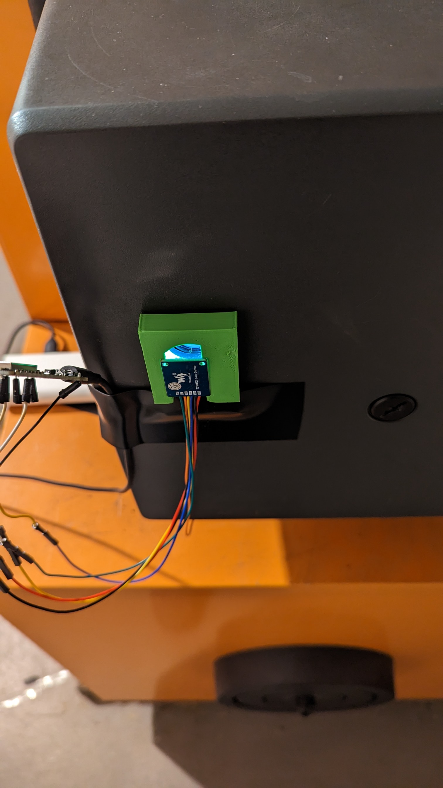
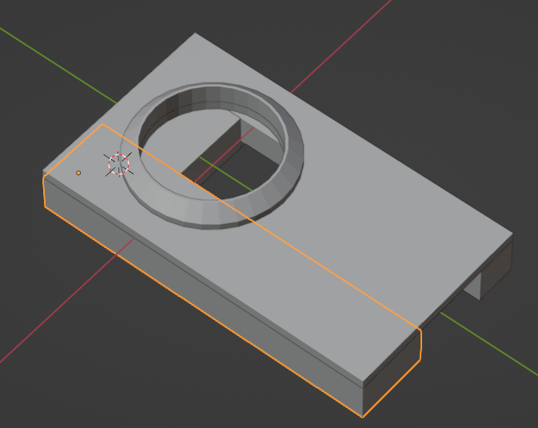
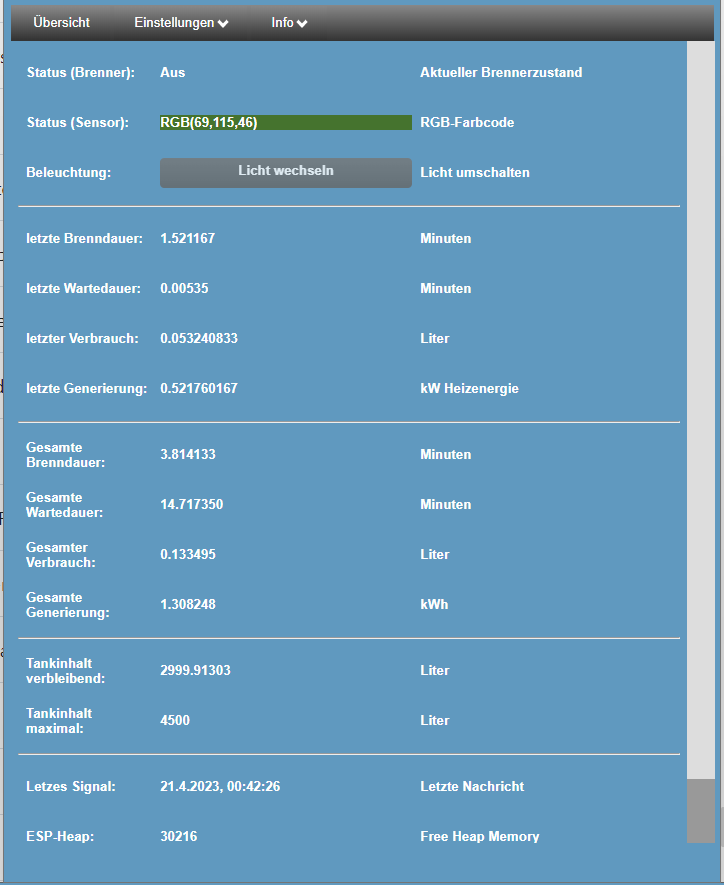
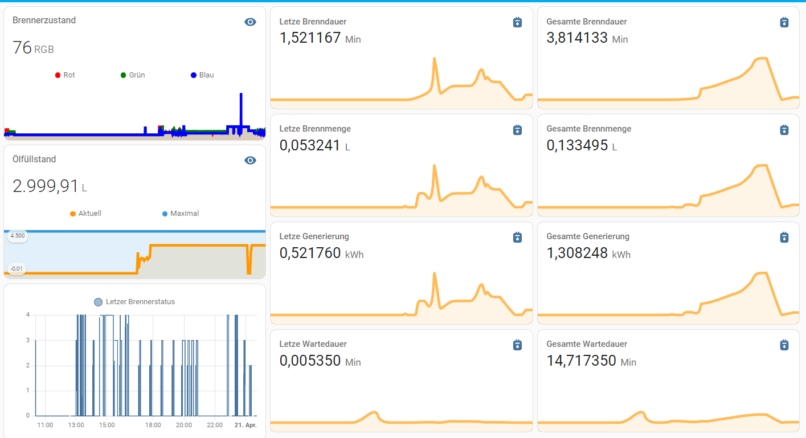

# OilMeter

Measure oil consumption on a ESP8266 via TCS34725 or APDS9960 color sensors and the burner status-LED or 
HC-SR04/JSN-SR04T distance-sensor (currently implementation phase).

## Oilmeter comes with the following features included:
- First start as AccessPoint (OilMeter, PWD: OilMeter), after saving Wifi-Settings it will connect to default Wifi.
- Nice handmade and Mobile-friendly Webinterface for configuration and status with live streaming updates via web-events.
- Reads the sensor status (Preheat, Blower start, burn, error and off) based on predefined color-ranges and calculates oil-consumption
  by the definition of L/h of your heater.
- MQTT-Connection with Homeassistant: Publishes status to a MQTT-Broker and automatically creates entities in Homeassistant.
- Updates on the fly with direct Firmware Uploads (powered by ElegantOTA).
- existing Sensor adapter plates can be 3D-Printed.

## Flashing
Please install Visual Studio code and inside visual studio code the PlatformIO Workbench.
Load the project folder and adapt your Com-Port in Platform.ini. Click Build and Upload.
for updates you can use the OTA-Feature and the .bin files included in this repository.
More installation Methods will follow (please help how to setup Chrome-Online Firmware flasher).

## Notes

If you have problems with ESP-restarts please consider that the burner needs a high voltage to start burning.
(in the webinterface you can see the reboot-cause. 'exception' can be a hint for such a high-voltage reset).
This high voltage can be transmitted via the wires and causes the ESP to restart. To avoid restarts you should
use isolated wires for the power-switch and sensor cabling and a separate isolation (e.g. Tabac-Box) to shim the esp
itself. make sure the isolation is connected to some ground of your house.
Also make sure you use a stable power-supply.

To make good measures you need to know the actual tank volume. You can do this by estimate based on the height of the oil in the tank
or you start from scratch if the tank is filled up to its maximum. After the first refill you can adapt your values based on whats 
really used vs. whats refilled via the adaption factor in the webinterface.

## Pictures

# Connection diagram (3.3 or 5V based on your Sensor)

| ESP   | GYP | TCS | HC/JSN |
| ----- | --- | --- | ---- |
| 3V3/5V| VCC | VIN | VCC  |
| GND   | GND | GND | GND  |
| D6    | INT | LED | ---- |
| D2    | SDA | SDA | ---- |
| D1    | SCL | SCL | ---- |
| D7    |     |     | TRIG |
| D8    |     |     | ECHO |

#Todo

- Integration of HC-SR04 Distance Sensor for Level Measurement.
- Multicolor LED for sensor status and system messages
- better feedback if setting was saved.
- auto adaptation of the correct factor value on fill-up (needs to be between 2 times full)
- animated svg-picture of the tank volume in percent
- Show system up time in webinterface.
- compress webpages and js with compressors and gzip before uploading.
- webpages based on local bootstrap.
- MQTT-Homeassistant optimizations and more values.
  

